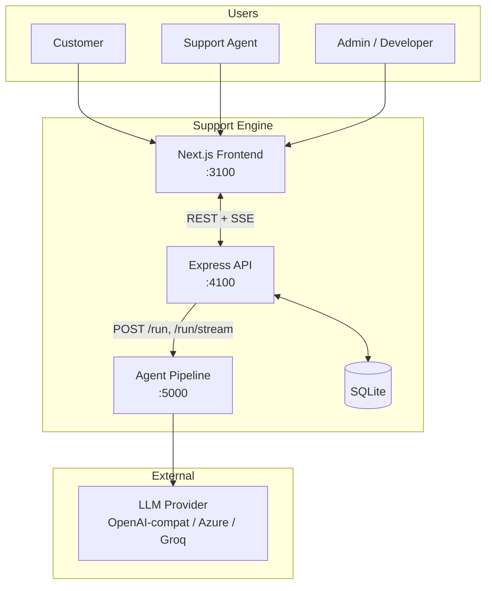
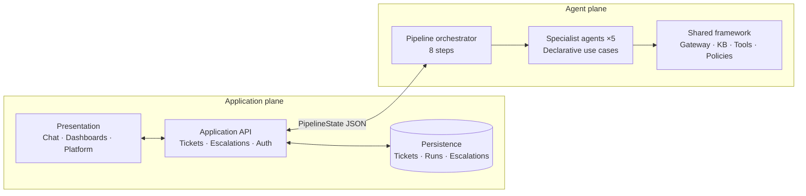
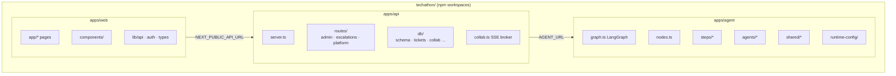
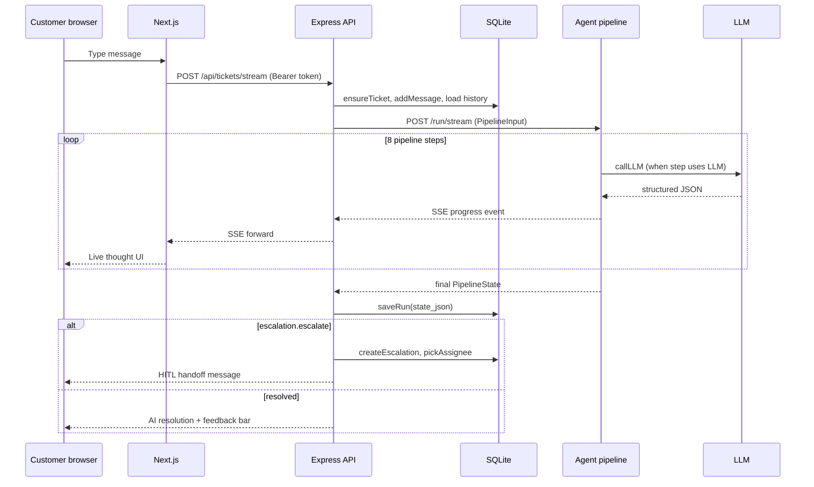
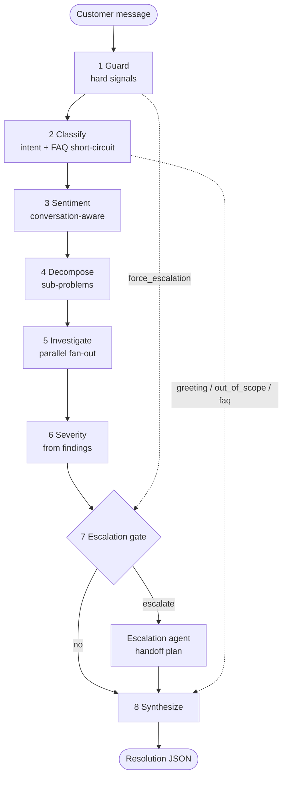
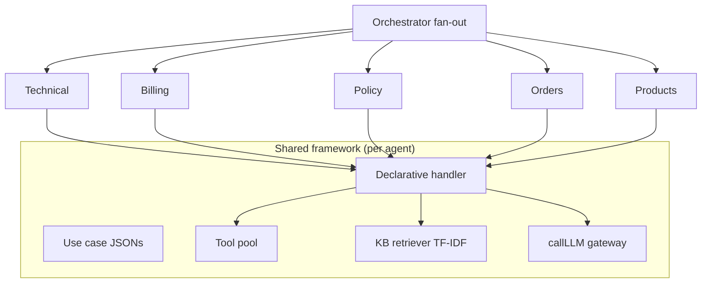
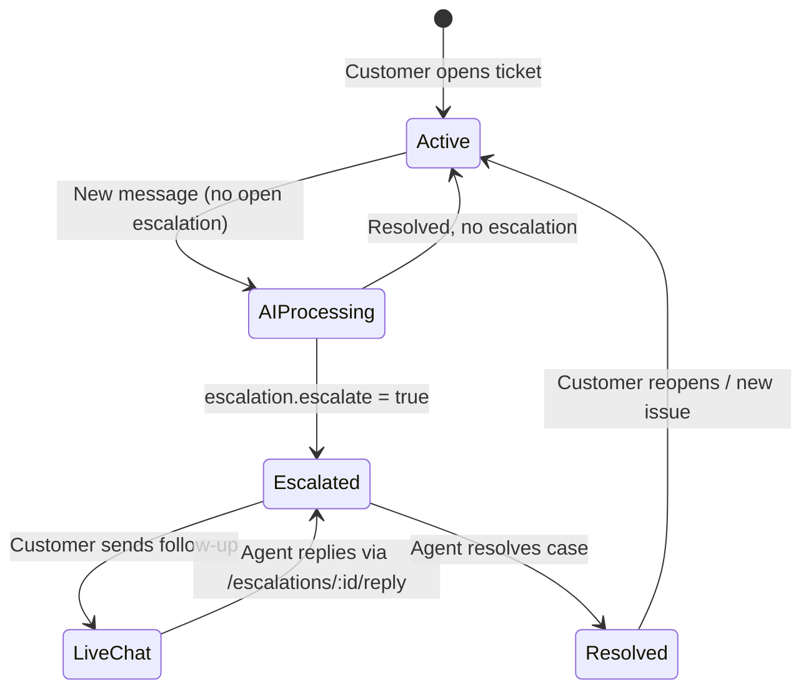
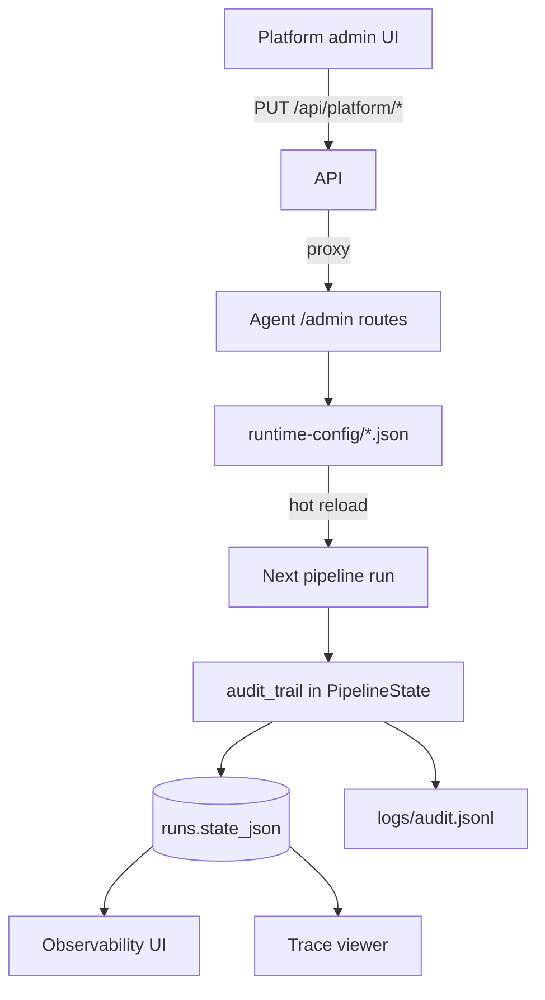

# System Architecture

Multi-Agent Customer Support Resolution Engine — e-commerce domain

**Docs chain:** [`README.md`](README.md) → **architecture.md** → [`hld.md`](hld.md) → [`technical-decisions.md`](technical-decisions.md) → [`lld.md`](lld.md)

---

## 1. What we built

A **three-service** system that accepts customer support messages, runs them through an **8-step LangGraph pipeline** with **five specialist AI agents**, persists tickets and audit trails, and hands off to **human agents** when policy or risk requires it.

| Concern | Where it lives |
|---------|----------------|
| Customer & admin UI | `apps/web` (Next.js 15) |
| Auth, persistence, HITL, SSE | `apps/api` (Express + SQLite) |
| Classification, agents, synthesis | `apps/agent` (LangGraph + shared framework) |

Services communicate **only over HTTP**. No cross-imports between `web`, `api`, and `agent`.

---

## 2. System context

---

## 3. Logical architecture (two planes)

| Plane | Responsibility | Stateless? |
|-------|----------------|------------|
| **Application** | Who is the user, what tickets exist, who owns escalations, notifications | No — owns SQLite |
| **Agent** | How to classify, investigate, and compose a reply | Yes — state passed in/out per run |

---

## 4. Deployment view

| Service | Port | Start command |
|---------|------|---------------|
| Web | 3100 | `npm run dev:web` |
| API | 4100 | `npm run dev:api` |
| Agent | 5000 | `npm run dev:agent` |
| All | — | `npm run dev:all` |

---

## 5. End-to-end request flow

---

## 6. Agent pipeline (8 steps)

| Step | Kind | Primary output |
|------|------|----------------|
| Guard | Rule | `guard.force_escalation` |
| Classify | LLM + keywords | `classification` (category, intents, multi-issue) |
| Sentiment | LLM + heuristic | `sentiment` (label, frustration, trend) |
| Decompose | LLM + heuristic | `sub_problems[]` |
| Investigate | LLM per agent | `agent_reports[]`, `investigation` |
| Severity | Rule | `severity.level`, `severity.priority` |
| Escalation | Rule gate + LLM | `escalation.escalate`, team, urgency |
| Synthesize | LLM + template | `resolution` (customer-facing reply) |

**Hard-signal shortcut:** When guard matches (legal, security, human request), decompose routes **only to policy** → `escalate_to_human` — no billing/technical fan-out.

---

## 7. Specialist agent model

| Specialist | Domain | Example use cases |
|------------|--------|-------------------|
| Technical | Login, checkout errors, app crashes | `error_diagnosis`, `account_access` |
| Billing | Charges, refunds, payment policies | `explain_charge`, `refund_eligibility`, `payment_policies` |
| Policy | Returns, cancellation, escalation | `return_policy`, `escalate_to_human` |
| Orders | Tracking, cancel/change | `order_tracking`, `cancel_change_order` |
| Products | Catalog, availability | `product_availability`, `product_info` |

Adding a use case = **one JSON file** in `agents/<domain>/usecases/`. Adding a specialist = **agent record** in Platform + `createAgent()` at boot.

---

## 8. Human-in-the-loop (HITL)

| Mode | Trigger | Message path |
|------|---------|--------------|
| **AI pipeline** | No open escalation on ticket | `POST /api/tickets` → full 8-step run |
| **Live human chat** | Open escalation exists | `POST /api/tickets/:id/messages` → human agent inbox |
| **Reopen triage** | Prior escalation resolved | Continuity step decides same owner vs new case |

Escalation assignment: **department** from primary domain → **least-loaded** human agent in that department.

---

## 10. Configuration & observability

| Config surface | File | Effect |
|----------------|------|--------|
| Guard phrases | `policies.json` | Hard-signal escalation |
| Escalation rules | `policies.json` | Which gates may open HITL |
| Intent thresholds | `policies.json` | Multi-issue + fallback |
| Specialist agents | `agents.json` | Routing keywords + teams |
| FAQ | `faq.json` | Pre-LLM canned answers |
| KB articles | `library/*.md` | Per-use-case retrieval scope |

---

## 11. Security boundaries

| Boundary | Mechanism |
|----------|-----------|
| API auth | Bearer session tokens; `requireRole(user \| agent \| admin)` |
| Agent admin | Separate admin token for `/admin/*` on agent service |
| Tool scope | Use case declares allowed tools; handler enforces |
| KB scope | Use case declares allowed files; retriever enforces |
| LLM prompts | `GUARDRAILS_BLOCK` on every system prompt (anti-injection, no fabrication) |
| SSE collab | Token via query string (EventSource limitation) |

---

## 13. Other Points

1. **Separation of concerns** — Application owns persistence and HITL; agent plane is stateless and swappable.
2. **Parallel specialists** — Mixed tickets decompose into independent sub-problems; `Promise.all` fan-out with per-agent timeout.
3. **Traceability** — Every customer-facing word traces to `agent_reports` + `audit_trail`; reasoning/evidence never LLM-invented in synthesis.
4. **Meaningful escalation** — Gate driven by risk signals and repeat frustration, not every `needs_info`; security/legal hard-signals bypass multi-domain split.
