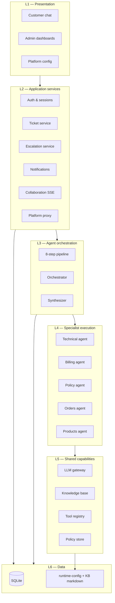
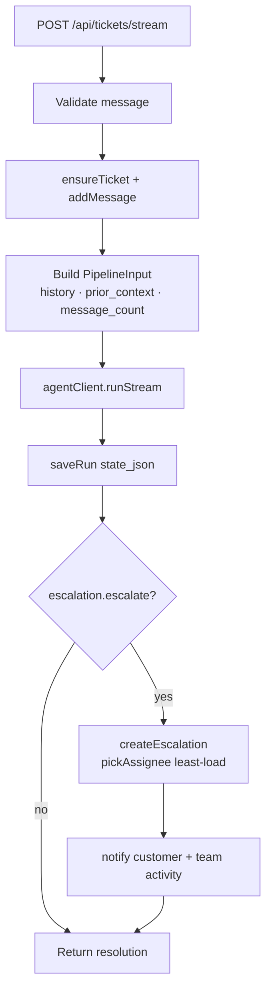
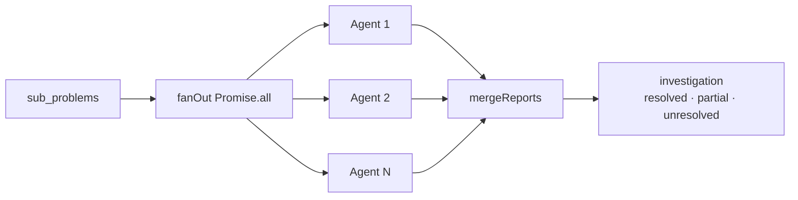
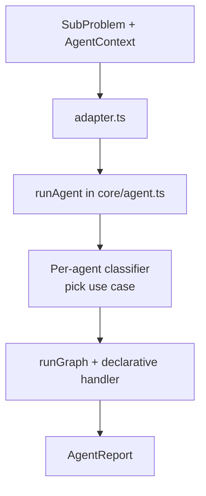
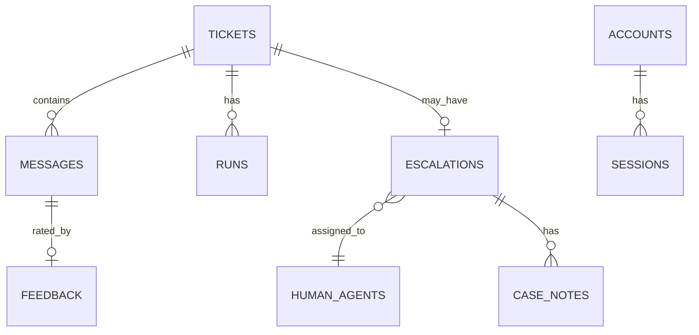

# High-Level Design (HLD)

Multi-Agent Customer Support Resolution Engine

**Docs chain:** [`README.md`](README.md) → [`architecture.md`](architecture.md) → **hld.md** → [`technical-decisions.md`](technical-decisions.md) → [`lld.md`](lld.md)

---

## 1. Design goals

| Goal | How we achieve it |
|------|-------------------|
| Route mixed tickets correctly | Intent classifier + decomposer → parallel fan-out |
| Specialist depth without code sprawl | Declarative JSON use cases per agent |
| Demo without LLM keys | Heuristic fallback on every step |
| Admin control without redeploy | Live config store (`runtime-config/`) |
| Auditability for judges | Typed `audit_trail[]` + persisted `runs.state_json` |
| Human takeover when needed | Escalation gate + SQLite escalations + live chat mode |

---

## 2. Layered structure

---

## 3. Application layer (`apps/api`)

### 3.1 Module map

| Module | Path | Responsibility |
|--------|------|----------------|
| Server bootstrap | `server.ts` | Express setup, auth routes, ticket submit/stream, mount route modules |
| Middleware | `routes/middleware.ts` | `authMiddleware`, `requireRole`, `canAccessTicket` |
| Tickets DB | `db/tickets.ts` | Tickets, messages, runs, presence locks |
| Escalations DB | `db/escalations.ts` | Create, assign, resolve, handoff |
| Collab DB | `db/collab.ts` | Presence, team activity, case notes |
| Notifications | `db/notifications.ts` | In-app notifications, feedback, config audit |
| Human agents | `db/agents.ts` | Roster seeding, CRUD |
| Admin routes | `routes/admin.ts` | Dashboard, observability, feedback, collab endpoints |
| Escalation routes | `routes/escalations.ts` | Reply, resolve, handoff, notes |
| Platform routes | `routes/platform.ts` | Proxy to agent admin API |
| Collab broker | `collab.ts` | In-memory SSE pub/sub |
| Agent client | `agentClient.ts` | HTTP to agent `/run` and `/run/stream` |
| Notify | `notify.ts` | In-app + optional Resend email |

### 3.2 Ticket processing flow (HLD)

### 3.3 Role model

| Role | `home` route | Capabilities |
|------|--------------|--------------|
| `user` | `/` | Chat, feedback, own tickets |
| `agent` | `/escalations` | Own escalations, reply, notes, collab |
| `admin` | `/tickets` | All dashboards, platform config, observability |

---

## 4. Agent layer (`apps/agent`)

### 4.1 Pipeline composition

| Component | File(s) | Role |
|-----------|---------|------|
| LangGraph graph | `graph.ts` | Wires 8 nodes; `StateGraph` with `PipelineState` annotation |
| Node adapters | `nodes.ts` | Async functions per step; audit events; hard-signal decompose shortcut |
| Linear fallback | `pipeline.ts` | Identical step order if LangGraph load fails |
| Step implementations | `steps/*.ts` | Pure(ish) business logic per step |
| Contracts | `contracts/types.ts` | Shared TypeScript types for pipeline I/O |
| CLI | `cli.ts` | Run single step or full pipeline from terminal |

### 4.2 Orchestration HLD

| Behavior | Detail |
|----------|--------|
| Parallelism | True `Promise.all` — wall-clock ≈ slowest agent |
| Timeout | 45s per agent; timed-out → `failed` report |
| Isolation | One agent failure does not block others |
| Merge | `overall_status` + `conflicts[]` for escalation/severity |

### 4.3 Specialist agent framework

**Per-agent lifecycle:**

1. **Domain gate** — confidence below threshold → `out_of_domain` or `needs_clarification`
2. **Use case routing** — LLM picks handler from agent's registry
3. **Param extraction** — LLM reads message for required fields
4. **Tool execution** — scoped to use case declaration
5. **KB retrieval** — TF-IDF over scoped markdown files
6. **Answer** — structured JSON `{ findings, actions, resolved }`

---

## 5. Frontend layer (`apps/web`)

### 5.1 Page map

| Route | Audience | Primary data |
|-------|----------|--------------|
| `/` | Customer | SSE pipeline stream, thoughts, feedback |
| `/login`, `/signup` | All | Auth |
| `/tickets` | Admin | `GET /api/dashboard/tickets` |
| `/escalations` | Agent, Admin | `GET /api/escalations` |
| `/collaboration` | Agent, Admin | `GET /api/collab/stream` |
| `/observability` | Admin | `GET /api/observability/runs` |
| `/trace/[ticketId]` | Admin, Agent | Runs + `PipelineFlow` + audit |
| `/feedback` | Admin | `GET /api/admin/feedback` |
| `/platform` | Admin | Platform proxy tabs |

### 5.2 Key UI components

| Component | File | Purpose |
|-----------|------|---------|
| `PipelineFlow` | `components/flow.tsx` | Animated 8-step graph from SSE |
| `RunDetails` / `AgentReportDetails` | `components/views.tsx` | Run cards, fan-out, evidence |
| `SentimentBadge` | `components/sentiment-badge.tsx` | Mood pill on dashboards |
| `AdminHeader` | `components/admin-nav.tsx` | Nav + notifications |
| Platform tabs | `app/platform/tabs/*.tsx` | One tab per config domain |

---

## 6. Data design (conceptual)

### 6.1 Core entities

### 6.2 Pipeline persistence

Each **run** stores the full `PipelineState` as JSON in `runs.state_json`. This powers:

- Observability dashboard (filter all runs)
- Trace viewer (replay any turn)
- `prior_context` on follow-up messages
- KB article generation (resolution + agent findings)

---

## 7. External interfaces (summary)

### 7.1 Customer-facing API

| Method | Path | Purpose |
|--------|------|---------|
| POST | `/api/tickets` | Submit message (sync) |
| POST | `/api/tickets/stream` | Submit with SSE progress |
| GET | `/api/tickets/:id` | Ticket + messages + latest run |
| POST | `/api/tickets/:id/messages` | Live message to human agent |
| POST | `/api/feedback` | Thumbs up/down on AI message |

### 7.2 Agent internal API

| Method | Path | Purpose |
|--------|------|---------|
| POST | `/run` | Execute pipeline (sync) |
| POST | `/run/stream` | Execute with SSE events |
| GET/PUT | `/admin/*` | KB, policies, FAQ, use cases (admin token) |

Full endpoint tables → [`lld.md`](lld.md) §6.

---

## 8. Specialist domain matrix

| Domain | Team (escalation) | Tools | KB files (typical) |
|--------|-------------------|-------|---------------------|
| Technical | Engineering On-call | `lookupErrorCode`, `accountStatus`, `serviceStatus` | `troubleshooting.md`, `account_help.md` |
| Billing | Billing Lead | `dbQuery`, `paymentStatus`, `subscriptionLookup` | `billing_policy.md`, `refund_policy.md` |
| Policy | Policy & Compliance | — | `return_policy.md`, `cancellation_policy.md`, `escalation_matrix.md` |
| Orders | Order Operations | `orderLookup` | `shipping_delivery.md` |
| Products | Merchandising | `productLookup` | `product_catalog.md` |

---

## 9. Stretch features (HLD)

| Feature | Components |
|---------|------------|
| Sentiment + frustration | `steps/sentiment.ts` → dashboards + escalation nudge |
| KB article generation | `shared/kb/generate.ts` → Platform KB tab → admin review → save |
| Real-time collaboration | `collab.ts` broker + `/collaboration` UI + heartbeats |
| Visual agent flow | `PipelineFlow` on trace + observability sheets |
| FAQ power | `policies/faq.ts` checked before classifier LLM |
| Feedback loop | `feedback` table + `/feedback` admin page |

---

## 10. Non-goals (current version)

| Item | Status |
|------|--------|
| Zendesk / Linear / Jira integration | Roadmap — API is channel-agnostic |
| Vector embeddings for KB | Interface ready; TF-IDF shipped |
| Distributed deployment | Single-node SQLite + in-memory SSE |
| Automated test suite | CLI supports per-step testing |

See [`technical-decisions.md`](technical-decisions.md) for rationale.
